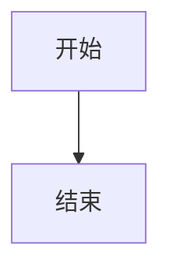

# Stark1898y 的个人知识库

基于 [VitePress](https://vitepress.dev/) 构建的个人知识库，记录嵌入式开发学习笔记和技术文档。

## 本地开发

### 已有仓库

```bash
npm install
npm run dev
```

### 新电脑 / 首次克隆

```bash
git clone https://github.com/stark1898y/stark1898y.github.io.git
cd stark1898y.github.io
npm install      # 还原依赖（package-lock.json 保证版本一致）
npm run dev      # 启动开发服务器
```

> `package-lock.json` 已纳入版本控制，`npm install` 会还原完全一致的依赖版本，不会出现环境差异问题。

### 局域网访问（手机预览等）

```bash
npx vitepress dev --host 0.0.0.0
```

访问 http://localhost:5173 预览。

## 项目结构

```
my_site/
├── index.md                 # 首页
├── docs/                    # 文档笔记（知识库内容）
│   ├── intro.md             # 知识库简介
│   ├── hardware/            # 硬件设计
│   │   ├── _category_.json  #   分类配置（标签、排序）
│   │   ├── tools.md         #   概述
│   │   ├── power/           #   电源相关
│   │   ├── interface/       #   接口协议
│   │   ├── protection/      #   保护器件
│   │   ├── component/       #   常用器件
│   │   └── wireless/        #   无线通信
│   ├── mcu/                 # MCU 开发
│   │   ├── stm32/           #   STM32
│   │   ├── ch32v/           #   WCH RISC-V
│   │   └── ble/             #   BLE 蓝牙
│   ├── software/            # 软件开发
│   │   ├── framework/       #   框架与架构
│   │   ├── component/       #   常用组件
│   │   ├── storage/         #   存储相关
│   │   ├── protocol/        #   通信协议
│   │   └── upgrade/         #   升级方案
│   ├── rtos/                # RTOS 系统
│   ├── tools/               # 开发工具
│   ├── linux/               # Linux 开发
│   ├── ai-python/           # AI & Python
│   └── resources/           # 学习资源
├── open-source/             # 开源项目（独立于 docs）
│   ├── index.md             #   项目概览
│   ├── _category_.json      #   分类配置
│   ├── power-calculator/    #   功耗计算器
│   └── gas-converter/       #   气体浓度换算
├── dev-tools/               # 在线开发工具分区（VitePress 页面）
│   ├── index.md             #   工具集概览
│   ├── _category_.json      #   分类配置
│   └── timestamp-converter-guide/   #   时间戳教程（独立文档页）
├── public/                  # 静态资源（图片、图标、工具页等）
│   ├── dev-tools/           #   工具静态页（一个工具一个文件夹）
│   │   ├── json-formatter/index.html
│   │   ├── timestamp-converter/index.html
│   │   └── base64/index.html
│   ├── gas-converter.png
│   ├── power-calc.png
│   └── logo.svg
├── .vitepress/              # VitePress 配置
│   ├── config.mts           #   站点配置（导航、搜索、页脚等）
│   ├── sidebar.ts           #   侧边栏自动生成脚本
│   └── theme/               #   自定义主题
│       ├── index.ts         #     主题入口
│       ├── style.css        #     自定义样式
│       └── Mermaid.vue      #     Mermaid 图表渲染组件
├── package.json
├── .gitignore
└── README.md
```

## 如何添加新文档

### 在已有分类下添加一篇新文章

直接在对应目录下新建 `.md` 文件即可，侧边栏会自动更新。

```bash
# 例如在硬件设计 > 电源相关下添加一篇新文章
echo "# 锂电池充电管理" > docs/hardware/power/battery-charger.md
```

- 文章标题会自动从 frontmatter `title` 或第一个 `# 标题` 提取
- 侧边栏按文件名中文排序

### 新建一个分类（新目录）

1. 在 `docs/` 下新建目录
2. 创建 `_category_.json` 指定分类名和排序

```json
{
  "label": "分类名称",
  "position": 10
}
```

3. 放入 `.md` 文章文件

`position` 控制分类在侧边栏中的顺序，数字越小越靠前。

### 新建一个子分类（二级目录）

同上，在父目录下创建子目录 + `_category_.json` 即可。

```
docs/新分类/
├── _category_.json       # {"label": "新分类", "position": 10}
├── overview.md           # 概览文章
└── 子分类/
    ├── _category_.json   # {"label": "子分类", "position": 1}
    └── article.md
```

### 文章 frontmatter（可选）

```markdown
---
title: 文章标题          # 侧边栏显示的名称（优先级高于 # 标题）
description: 简短描述     # SEO 描述
---
```

### 在文档中使用 Mermaid 图表

已内置支持，直接使用 ````mermaid` 代码块即可：

````markdown

````

支持的图表类型：`graph`、`flowchart`、`sequenceDiagram`、`classDiagram`、`stateDiagram`、`gantt`、`pie` 等。

## 构建部署

### 本地验证

```bash
npm run build
npm run preview
```

### 部署到 GitHub Pages

推送 `main` 分支后，GitHub Actions 自动构建并部署（使用 Pages Actions 环境）。

> 首次部署需要在仓库 Settings > Pages 中将 Source 设为 "GitHub Actions"。

## 配置说明

| 文件 | 作用 |
|------|------|
| `config.mts` | 站点全局配置：标题、导航栏、搜索、页脚、编辑链接等 |
| `sidebar.ts` | 自动扫描 `docs/` 和 `open-source/` 目录生成侧边栏 |
| `theme/index.ts` | 自定义主题入口，加载样式和组件 |
| `theme/style.css` | 首页项目卡片、平台卡片等自定义样式 |
| `theme/Mermaid.vue` | Mermaid 图表客户端渲染组件 |

## 开发工具分区（dev-tools）路径约定

> ⚠️ 这是 2026-08 路径归并后的最终约定，改动工具路径前务必阅读本节，避免再次出现 404。

### 双目录职责划分

开发工具分区由**两个目录配合**组成，构建后按路径合并进 `dist/`：

| 目录 | 职责 | 构建产物 |
|------|------|----------|
| `dev-tools/*.md` | VitePress 文档页（概览、教程） | `dist/dev-tools/*.html`（带主题） |
| `public/dev-tools/<tool>/` | 纯静态工具页（单文件 HTML） | `dist/dev-tools/<tool>/index.html`（原样复制） |

### 路径对照表

| 访问路径 | 实际来源 |
|----------|----------|
| `/dev-tools/` | `dev-tools/index.md` |
| `/dev-tools/timestamp-converter/` | `public/dev-tools/timestamp-converter/index.html` |
| `/dev-tools/json-formatter/` | `public/dev-tools/json-formatter/index.html` |
| `/dev-tools/base64/` | `public/dev-tools/base64/index.html` |
| `/dev-tools/timestamp-converter-guide/` | `dev-tools/timestamp-converter-guide/index.md` |

### 新增一个工具的步骤

1. 在 `public/dev-tools/` 下创建 `<tool>/index.html`，单文件自包含（CSS/JS 内联）
2. 工具页内保留：面包屑（`首页 / 开发工具 / <工具名>`）、`← 返回开发工具`（`/dev-tools/`）、相关工具卡片、GitHub 源码链接
3. 在 `dev-tools/index.md` 概览页加入分类与入口链接
4. 在 `.vitepress/config.mts` 导航的「开发工具」下拉中加一项
5. 如需要面包屑高亮，在 `.vitepress/theme/Breadcrumb.vue` 的 `breadcrumbMap` 加条目
6. 运行 `npm run build` 验证，确认 `dist/dev-tools/<tool>/index.html` 输出的是工具 HTML

### 红线规则（避免 404）

- **工具子目录下禁止出现 `.md` 文件**：若 `dev-tools/<tool>/`（源码）与 `public/dev-tools/<tool>/`（静态）同名，VitePress 页面会与静态 HTML 冲突覆盖
- **工具文档页必须使用不同目录名**：如教程放 `dev-tools/timestamp-converter-guide/`，不能叫 `timestamp-converter/`
- **`public/tools/` 已废弃**：旧路径 `/tools/<tool>/` 全部迁移到 `/dev-tools/<tool>/`，代码中不得再引用 `/tools/`
- **删除工具时**：同时清理 `public/dev-tools/<tool>/`、`dev-tools/index.md` 入口、`config.mts` 导航项、`Breadcrumb.vue` 映射

### 旧路径检查方法

```bash
# 搜索旧路径残留（应无输出或仅剩 /docs/tools/ 知识库页面）
rg -n "public/tools|/tools/timestamp|/tools/json|/tools/base64" --glob "*.{md,ts,mts,json,vue,html}"
```

## 命令速查

| 命令 | 作用 |
|------|------|
| `npm run dev` | 启动开发服务器 |
| `npm run build` | 生产构建 |
| `npm run preview` | 预览生产构建 |

## 声明

本知识库内容仅供学习参考，欢迎阅读和分享。
