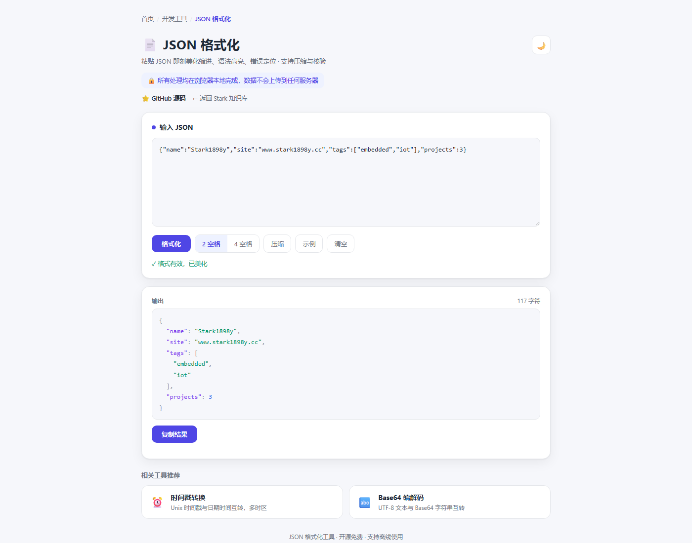

# JSON 格式化

在线 **JSON 格式化与校验**工具，粘贴即刻美化缩进并语法高亮，支持压缩、错误定位（行/列）、一键复制。

> **定位说明**：所有处理均在浏览器本地完成，JSON 数据不会上传到任何服务器，支持离线使用。

**功能特性**：

- **一键美化**：2/4 空格缩进切换，语法高亮（键 / 字符串 / 数字 / 布尔 / 空值）
- **校验与错误定位**：解析失败时提示具体行号、列号
- **压缩**：移除空白与缩进，输出紧凑 JSON
- **示例与清空**：内置示例数据，一键清空重来
- **复制结果**：格式化 / 压缩结果一键复制

**开源地址**：[GitHub](https://github.com/stark1898y/stark1898y.github.io/tree/main/public/tools/json-formatter)

## 界面预览

## 在线工具

  <a href="/tools/json-formatter/" target="_blank" style="display: inline-block; padding: 8px 20px; background: var(--vp-c-brand); color: white; border-radius: 6px; text-decoration: none; font-size: 14px; font-weight: 500;">在新窗口打开 →</a>
  内嵌页面显示不全时可点击上方按钮跳转

<iframe
  src="/tools/json-formatter/"
  style="width: 100%; height: 760px; border: none; border-radius: 8px; box-shadow: 0 2px 10px rgba(0,0,0,0.1)"
  title="JSON 格式化"
  loading="lazy"
></iframe>
