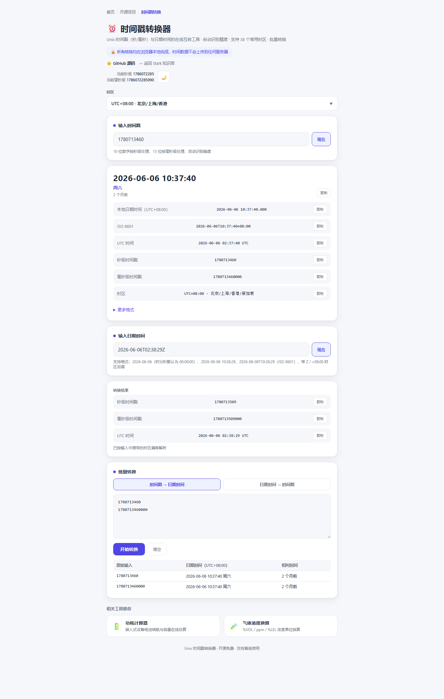

# 时间戳转换

Unix 时间戳（秒/毫秒）与日期时间**双向互转**的在线工具，自动识别秒级/毫秒级精度，支持 38 个常用时区切换、多格式输出与批量转换。

> **定位说明**：所有转换均在浏览器本地完成，时间数据不上传任何服务器，支持离线使用。

**功能特性**：

- **双向转换**：时间戳 → 日期时间 / 日期时间 → 时间戳
- **精度自动识别**：10 位秒级、13 位毫秒级，粘贴即转，无需手动切换
- **多时区支持**：38 个常用时区，支持按城市/偏移搜索（北京/上海、东京、纽约等）
- **多格式输出**：本地时间、ISO 8601、RFC 2822、UTC、MySQL DATETIME 等
- **相对时间**：自动显示「3 小时前」「61 天后」等相对时间
- **批量转换**：一次粘贴多行时间戳或日期，批量输出结果表格
- **一键当前时间**：点击「现在」即刻填入当前时间戳/日期时间
- **完全本地处理**：零依赖单文件，无任何网络请求，支持离线使用

**开源地址**：[GitHub](https://github.com/stark1898y/stark1898y.github.io/tree/main/public/tools/timestamp-converter) | [详细博客文章](./timestamp-converter-guide.md)

## 界面预览

## 使用说明

### 时间戳 → 日期时间

输入 10 位秒级或 13 位毫秒级时间戳，自动识别精度并输出：

- 所选时区下的日期时间、星期、相对时间
- ISO 8601、RFC 2822、UTC、MySQL DATETIME 等多种格式
- 秒级/毫秒级时间戳（便于校验）

### 日期时间 → 时间戳

支持格式：

| 格式 | 示例 | 说明 |
| :--- | :--- | :--- |
| 日期 | `2026-06-06` | 时分秒默认为 00:00:00 |
| 日期 + 时间 | `2026-06-06 10:38:29` | 空格分隔 |
| ISO 8601 | `2026-06-06T10:38:29` | 标准格式 |
| 带时区 | `2026-06-06T02:38:29Z` | Z 表示 UTC |
| 带偏移 | `2026-06-06T10:38:29+08:00` | +08:00 表示东八区 |

### 时区说明

时间戳是绝对时间（UTC），转换为本地时间时需要叠加时区偏移。默认北京/上海（UTC+8），可切换任意时区查看同一时刻的当地时间。

> 例如时间戳 `0`：UTC 为 1970-01-01 00:00:00，北京时间 1970-01-01 08:00:00，纽约时间 1969-12-31 19:00:00（日期也会变化）。

---

## 在线工具

  <a href="/tools/timestamp-converter/" target="_blank" style="display: inline-block; padding: 8px 20px; background: var(--vp-c-brand); color: white; border-radius: 6px; text-decoration: none; font-size: 14px; font-weight: 500;">在新窗口打开 →</a>
  内嵌页面显示不全时可点击上方按钮跳转

<iframe
  src="/tools/timestamp-converter/"
  style="width: 100%; height: 2000px; border: none; border-radius: 8px; box-shadow: 0 2px 10px rgba(0,0,0,0.1)"
  title="时间戳转换器"
  loading="lazy"
></iframe>
