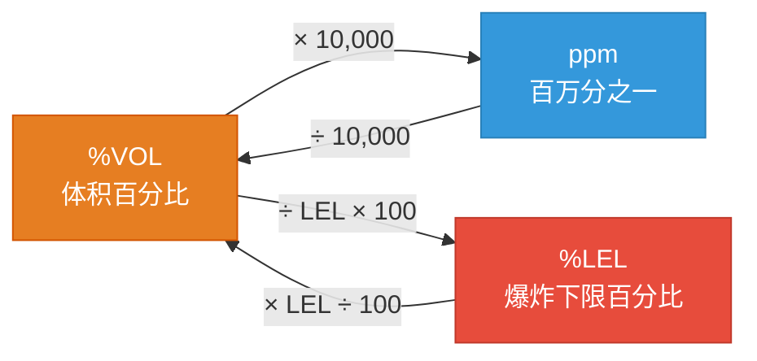
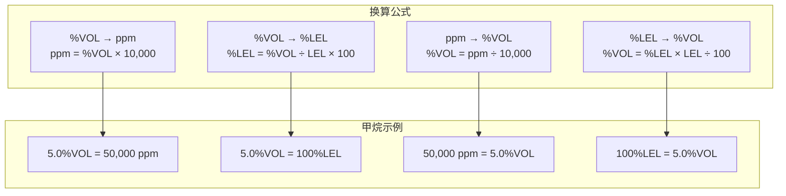
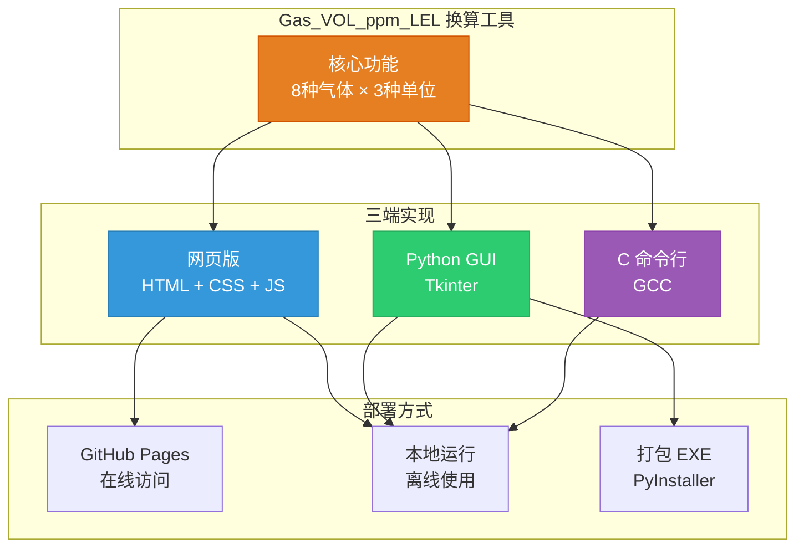
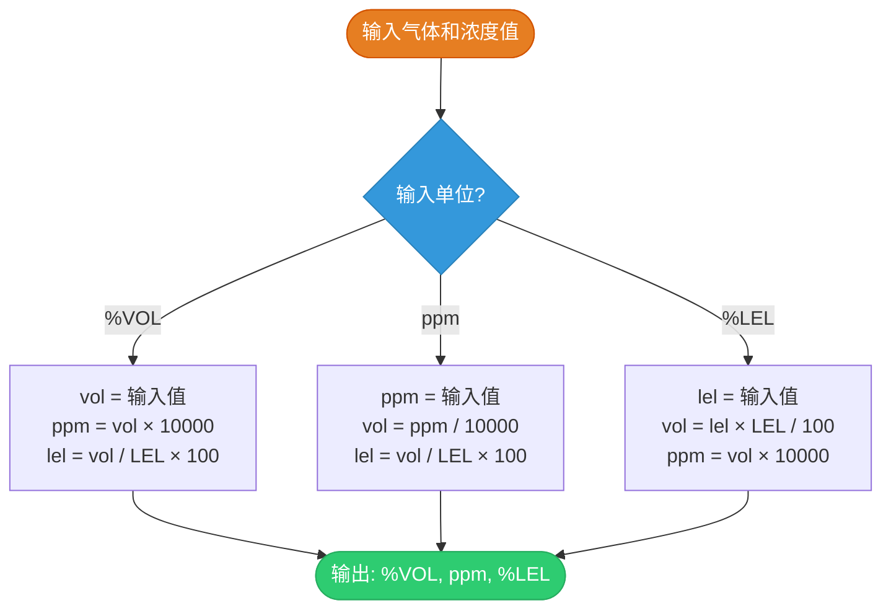

# 可燃气体浓度单位换算：%VOL、ppm、%LEL 完全指南

> 做气体检测、安全监测的工程师，一定绕不开这三个单位：**%VOL**、**ppm**、**%LEL**。它们分别代表什么？如何互相转换？本文将彻底讲清楚，并提供一个开源换算工具。
>
> 👉 **在线体验**：[https://stark1898y.github.io/Gas_VOL_ppm_LEL/](https://stark1898y.github.io/Gas_VOL_ppm_LEL/)

---

## 一、为什么需要换算？

在工业安全、环境监测、石化生产等场景中，可燃气体浓度是一个关键参数。但不同的设备、仪表、标准使用不同的单位：

- 有些传感器输出 **ppm**（百万分之一）
- 有些报警阈值用 **%LEL**（爆炸下限百分比）
- 气体分析仪可能直接显示 **%VOL**（体积百分比）

如果不理解这些单位的关系，可能会导致：

- 报警阈值设置错误
- 安全风险评估失误
- 测量数据无法对比

---

## 二、三种单位的定义

### 1. %VOL（体积百分比）

表示气体在混合气体中的体积占比，**1 %VOL = 1% 体积**。

例如：空气中氧气浓度约为 20.9%VOL。

### 2. ppm（parts per million，百万分之一）

表示气体在混合气体中的体积占比，以百万分之一为单位。

**换算关系：1 %VOL = 10,000 ppm**

例如：5000 ppm = 0.5%VOL = 0.005 体积占比。

### 3. %LEL（爆炸下限百分比）

表示当前气体浓度占该气体爆炸下限（LEL）的百分比。

**什么是爆炸下限（LEL）？**

可燃气体与空气混合后，浓度过低不会燃烧，浓度过高则因氧气不足也不会燃烧。能发生爆炸的最低浓度称为 **爆炸下限（LEL）**，最高浓度称为 **爆炸上限（UEL）**。

**100%LEL = 该气体的 LEL 值（%VOL）**

例如：甲烷的 LEL = 5.0%VOL，所以：

- 100%LEL = 5.0%VOL = 50,000 ppm
- 10%LEL = 0.5%VOL = 5,000 ppm

---

## 三、三种单位的关系



---

## 四、换算公式

以甲烷（LEL = 5.0%VOL）为例：



**快速记忆：**

- 1 %VOL = 10,000 ppm
- 100%LEL = LEL值（%VOL）

---

## 四、常见可燃气体参数

|   气体   |  分子式  | LEL (%VOL) | UEL (%VOL) |     100%LEL 对应值     |
| :------: | :------: | :--------: | :--------: | :--------------------: |
|   甲烷   |   CH₄   |    5.0    |    15.0    |  5.0%VOL = 50,000 ppm  |
|   乙烷   |  C₂H₆  |    3.0    |    15.5    |  3.0%VOL = 30,000 ppm  |
|   丙烷   |  C₃H₈  |    2.1    |    9.5    |  2.1%VOL = 21,000 ppm  |
|   丁烷   | C₄H₁₀ |    1.8    |    8.4    |  1.8%VOL = 18,000 ppm  |
|   氢气   |   H₂   |    4.0    |    75.0    |  4.0%VOL = 40,000 ppm  |
|   乙烯   |  C₂H₄  |    2.7    |    36.0    |  2.7%VOL = 27,000 ppm  |
|   乙炔   |  C₂H₂  |    2.5    |    81.0    |  2.5%VOL = 25,000 ppm  |
| 一氧化碳 |    CO    |    12.5    |    74.2    | 12.5%VOL = 125,000 ppm |

**注意：不同气体的 LEL 差异很大！**

甲烷 10%LEL = 5,000 ppm，而一氧化碳 10%LEL = 12,500 ppm。所以**不能直接比较不同气体的 %LEL 值**，必须换算成同一单位。

---

## 五、实际应用举例

### 例1：甲烷传感器读数换算

某甲烷传感器显示 **25,000 ppm**，换算：

```
%VOL = 25,000 / 10,000 = 2.5%VOL
%LEL = 2.5 / 5.0 × 100 = 50%LEL
```

结论：已达到爆炸下限的一半，**属于危险浓度**！

### 例2：设置报警阈值

根据国家标准 GB 12358，可燃气体报警阈值通常设为：

- 一级报警：25%LEL
- 二级报警：50%LEL

对于甲烷：

```
一级报警 = 25%LEL = 5.0% × 25% = 1.25%VOL = 12,500 ppm
二级报警 = 50%LEL = 5.0% × 50% = 2.5%VOL = 25,000 ppm
```

---

## 六、开源换算工具

为方便快速换算，我开发了一个支持 **8 种常见可燃气体** 的换算工具，提供三种版本：



### 特性

- ✅ 支持甲烷、乙烷、丙烷、丁烷、氢气、乙烯、乙炔、一氧化碳
- ✅ %VOL、ppm、%LEL 三种单位任意互转
- ✅ 三端统一：网页版、Python GUI、C 命令行
- ✅ 零依赖，单 HTML 文件，可离线使用

### 1. 网页版（推荐）

在线使用：[GitHub Pages](https://stark1898y.github.io/Gas_VOL_ppm_LEL/)

或下载 `docs/index.html` 直接用浏览器打开，无需联网。


### 2. Python 桌面版

```bash
cd python
python gas_vol_ppm_lel.py
```


### 3. C 命令行版

```bash
cd c
gcc gas_vol_ppm_lel.c -o gas -fexec-charset=GBK
./gas
# 输入: 气体编号 单位编号 值
# 示例: 1 1 5.0  →  甲烷 %VOL=5.0
```


---

## 七、技术实现

### 计算流程



### 数据结构（C 版本）

```c
typedef struct {
    const char *name;    // 气体名称
    const char *formula; // 分子式
    double lel;          // 爆炸下限 %VOL
    double uel;          // 爆炸上限 %VOL
} GasInfo;

static const GasInfo gas_table[] = {
    {"甲烷",     "CH4",   5.0,  15.0},
    {"乙烷",     "C2H6",  3.0,  15.5},
    // ... 共 8 种气体
};
```

### 核心计算函数

```python
def calculate(lel_limit, input_value, input_unit):
    if input_unit == "ppm":
        ppm = input_value
        vol = ppm / 10000
        lel = vol / lel_limit * 100
    elif input_unit == "%LEL":
        lel = input_value
        vol = lel * lel_limit / 100
        ppm = vol * 10000
    else:  # %VOL
        vol = input_value
        ppm = vol * 10000
        lel = vol / lel_limit * 100
    return vol, ppm, lel
```

---

## 八、常见问题

### Q1：为什么不同气体的 %LEL 不能直接比较？

因为不同气体的 LEL 值不同。甲烷 50%LEL = 2.5%VOL，而氢气 50%LEL = 2.0%VOL，虽然都是 50%LEL，但实际浓度不同。

### Q2：ppm 和 mg/m³ 有什么区别？

ppm 是体积浓度，mg/m³ 是质量浓度。换算需要知道气体分子量：

```
mg/m³ = ppm × M / 22.4  （标准状况下）
```

其中 M 为气体摩尔质量（g/mol）。

### Q3：安全浓度是多少？

一般规定：

- 可燃气体报警阈值：25%LEL（一级）、50%LEL（二级）
- 有毒气体（如 CO）：阈值用 ppm 表示，如 CO 为 24 ppm（8h 时间加权平均值）

---

## 九、总结

|   转换方向   |            公式            |
| :----------: | :------------------------: |
| %VOL → ppm |    ppm = %VOL × 10,000    |
| %VOL → %LEL | %LEL = (%VOL / LEL) × 100 |
| ppm → %VOL |    %VOL = ppm / 10,000    |
| %LEL → %VOL | %VOL = (%LEL × LEL) / 100 |

**记住关键：1 %VOL = 10,000 ppm，100%LEL = LEL值（%VOL）**

---

## 项目地址

> 🔗 **在线体验**：[https://stark1898y.github.io/Gas_VOL_ppm_LEL/](https://stark1898y.github.io/Gas_VOL_ppm_LEL/)

| 平台 | 链接 | 说明 |
|:----:|:----:|:----:|
| ⭐ GitHub | [stark1898y/Gas_VOL_ppm_LEL](https://github.com/stark1898y/Gas_VOL_ppm_LEL) | 主仓库 |
| 🚀 Gitee | [stark1898/Gas_VOL_ppm_LEL](https://gitee.com/stark1898/Gas_VOL_ppm_LEL) | 国内镜像 |

欢迎 **Star** ⭐ | **Fork** 🍴 | **Issue** 🐛
