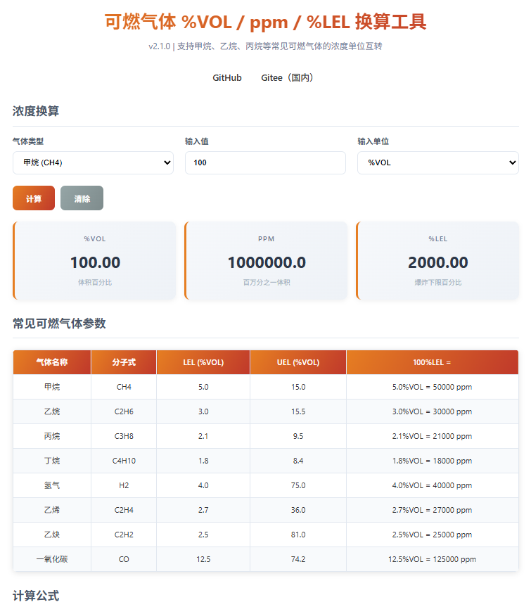
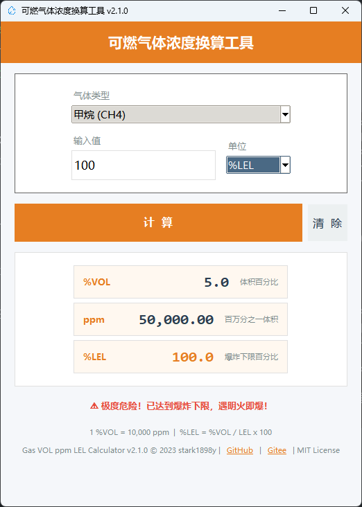
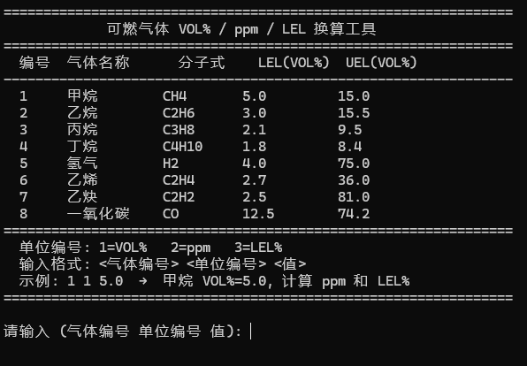

# 气体浓度换算

可燃气体浓度单位 **%VOL**、**ppm**、**%LEL** 之间的在线换算工具，支持 8 种常见可燃气体，提供网页版、Python GUI、C 命令行三种实现。

**功能特性**：

- **8 种常见可燃气体**：甲烷、乙烷、丙烷、丁烷、氢气、乙烯、乙炔、一氧化碳
- **三种单位互转**：%VOL（体积百分比）、ppm（百万分之一体积）、%LEL（爆炸下限百分比）
- **三端统一实现**：C 命令行版、Python GUI 桌面版、纯前端网页版
- **零依赖网页版**：单 HTML 文件，可直接部署到 GitHub Pages

**开源地址**：[GitHub](https://github.com/stark1898y/Gas_VOL_ppm_LEL) | [Gitee（国内）](https://gitee.com/stark1898/Gas_VOL_ppm_LEL) | [详细博客文章](./ppm、VOL% 和 LEL 之间的换算.md)

## 界面预览

### 网页版



### Python 桌面版



### C 命令行版



## 计算公式

```
1 %VOL = 10,000 ppm
%LEL = (%VOL / 气体LEL值) × 100
```

**示例（甲烷，LEL = 5.0 %VOL）**：

- 10% LEL = 5.0% × 10% = 0.5 %VOL = 5,000 ppm
- 100% LEL = 5.0 %VOL = 50,000 ppm

## 支持的气体

| 气体名称 | 分子式 | LEL (%VOL) | UEL (%VOL) | 100% LEL = |
| :---: | :---: | :---: | :---: | :---: |
| 甲烷 | CH₄ | 5.0 | 15.0 | 5.0% VOL = 50,000 ppm |
| 乙烷 | C₂H₆ | 3.0 | 15.5 | 3.0% VOL = 30,000 ppm |
| 丙烷 | C₃H₈ | 2.1 | 9.5 | 2.1% VOL = 21,000 ppm |
| 丁烷 | C₄H₁₀ | 1.8 | 8.4 | 1.8% VOL = 18,000 ppm |
| 氢气 | H₂ | 4.0 | 75.0 | 4.0% VOL = 40,000 ppm |
| 乙烯 | C₂H₄ | 2.7 | 36.0 | 2.7% VOL = 27,000 ppm |
| 乙炔 | C₂H₂ | 2.5 | 81.0 | 2.5% VOL = 25,000 ppm |
| 一氧化碳 | CO | 12.5 | 74.2 | 12.5% VOL = 125,000 ppm |

> **注意**：不同气体的 LEL 差异很大，不能直接比较 %LEL 值，必须换算成同一单位。

---

## 在线换算工具

<iframe
  src="https://stark1898y.github.io/Gas_VOL_ppm_LEL/"
  style={{
    width: '100%',
    height: '600px',
    border: 'none',
    borderRadius: '8px',
    boxShadow: '0 2px 10px rgba(0,0,0,0.1)'
  }}
  title="气体浓度换算"
  loading="lazy"
/>
