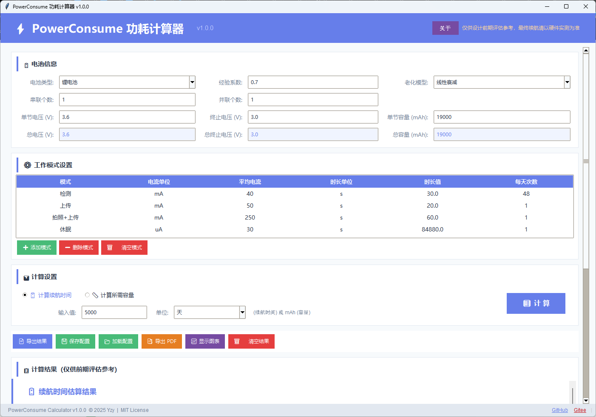
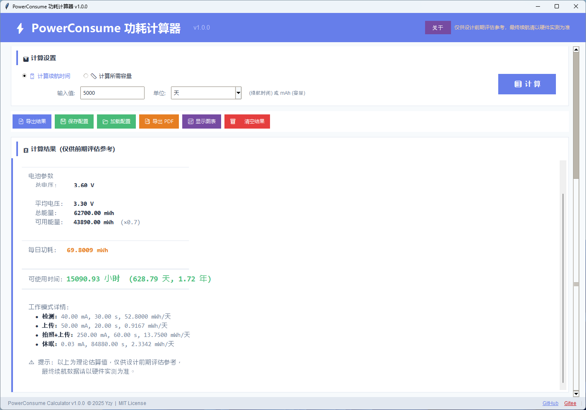
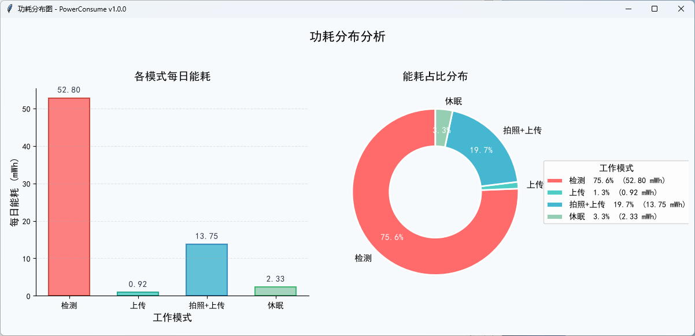
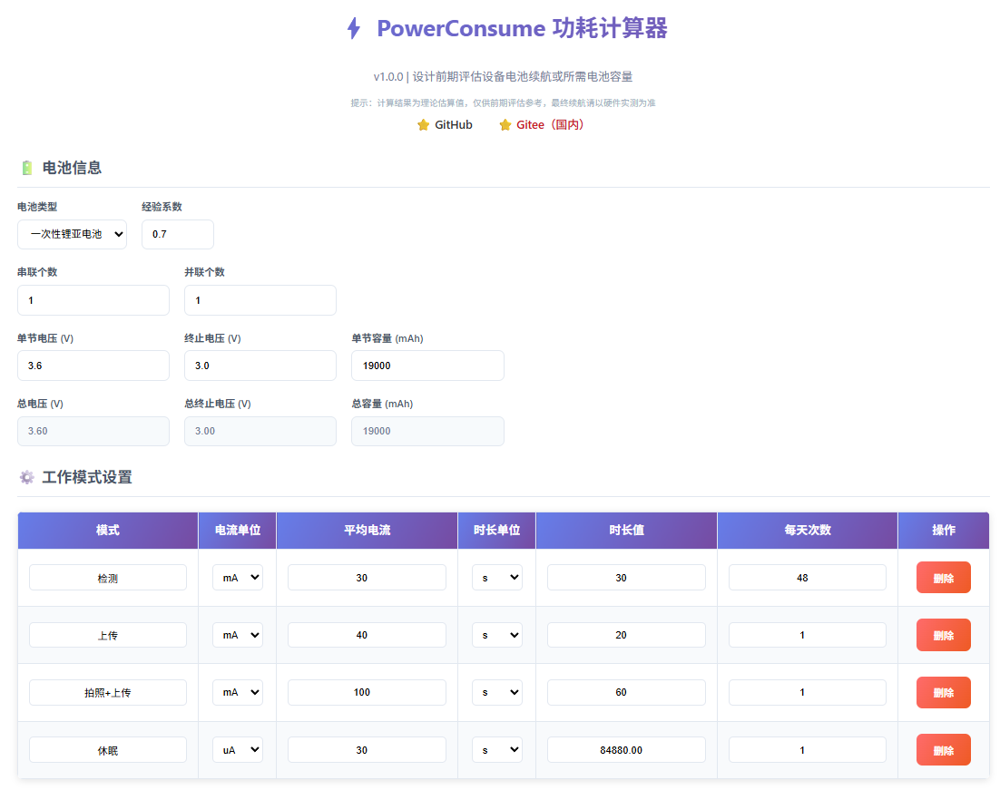
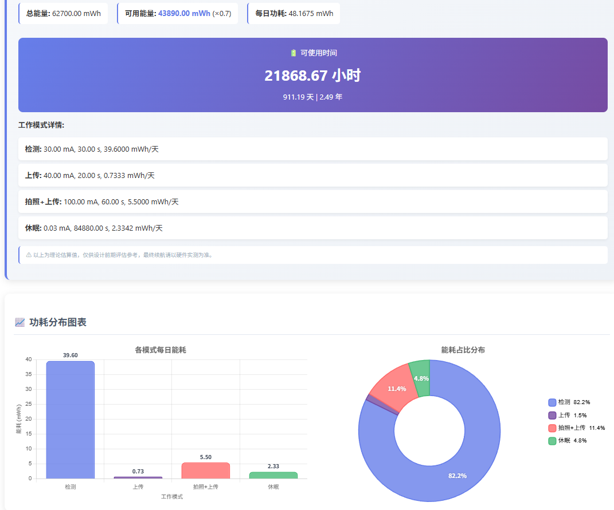

# 功耗计算器

嵌入式设备电池续航时间与电池容量的**在线估算工具**，专为硬件设计前期评估阶段打造。在还没有 PCB 样品、无法用仪器实测时，基于芯片数据手册的典型电流值快速估算续航量级，辅助电池选型和功耗预算规划。

> **定位说明**：计算结果为理论估算值，不可替代实测验证。最终量产产品的续航数据仍需以硬件实测为准。

**功能特性**：

- **多种计算模式**：计算续航时间 / 计算所需电池容量
- **多种电池类型**：锂电池、一次性锂亚电池、碱性干电池（可自定义参数）
- **多工作模式**：支持添加、删除、编辑多种工作模式（检测、上传、拍照、休眠等）
- **自动计算休眠时长**：根据其他模式的活跃时间自动计算休眠时长
- **串并联配置**：支持多节电池串联升压和并联增容
- **经验系数**：考虑电池放电效率（0.6~0.9 可调）
- **图表可视化**：柱状图 + 环形图展示能耗分布
- **多种单位**：电流支持 μA / mA，时长支持 ms、s、min、h、天

**开源地址**：[GitHub](https://github.com/stark1898y/Power-Consumption-Calculator) | [Gitee（国内）](https://gitee.com/stark1898/power-consumption-calculator) | [详细博客文章](./power-consume-calculator-guide.md)

## 界面预览

### 桌面版（Python + Tkinter）







### 纯前端版（HTML + Chart.js）





## 计算公式

### 续航时间计算

```
总电压 = 单节电压 × 串联数
总容量 = 单节容量 × 并联数
平均电压 = (总电压 + 终止电压 × 串联数) / 2
总能量 = 总容量 × 平均电压        (mWh)
可用能量 = 总能量 × 经验系数
每日功耗 = Σ(电流 × 时长 × 平均电压 / 3600 × 每日次数)
续航天数 = 可用能量 / 每日功耗
```

### 所需容量计算

```
所需能量 = 每日功耗 × 目标天数
所需容量 = 所需能量 / (平均电压 × 经验系数)
```

## 电池类型预设

| 电池类型 | 满电电压 | 终止电压 | 典型容量 |
| :---: | :---: | :---: | :---: |
| 锂电池 (Li-ion) | 4.2V | 3.6V | 3500 mAh |
| 锂亚电池 (Li-SOCl₂) | 3.6V | 3.0V | 2600 mAh |
| 碱性干电池 (AA) | 1.5V | 0.9V | 2500 mAh |

> 以上为默认预设值，均可自定义修改。

## 适用场景

| 阶段 | 方式 | 说明 |
| :---: | :---: | :--- |
| 设计前期 | **本工具估算** | 无硬件样品时，基于数据手册快速评估续航量级 |
| 打样后 | 仪器实测 | 用万用表 / 示波器 / 功耗分析仪实测各模式真实电流 |
| 量产前 | 高低温老化测试 | 验证极端温度下的实际续航表现 |

---

## 在线工具

<iframe
  src="https://stark1898y.github.io/Power-Consumption-Calculator/"
  style={{
    width: '100%',
    height: '900px',
    border: 'none',
    borderRadius: '8px',
    boxShadow: '0 2px 10px rgba(0,0,0,0.1)'
  }}
  title="功耗计算器"
  loading="lazy"
/>
