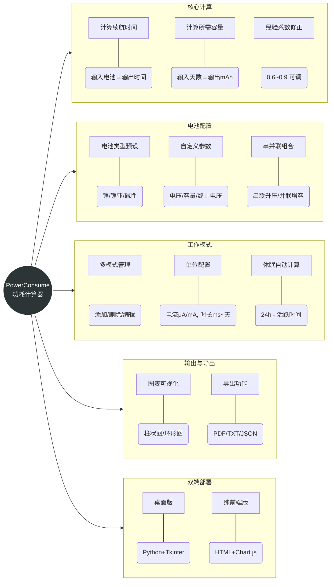
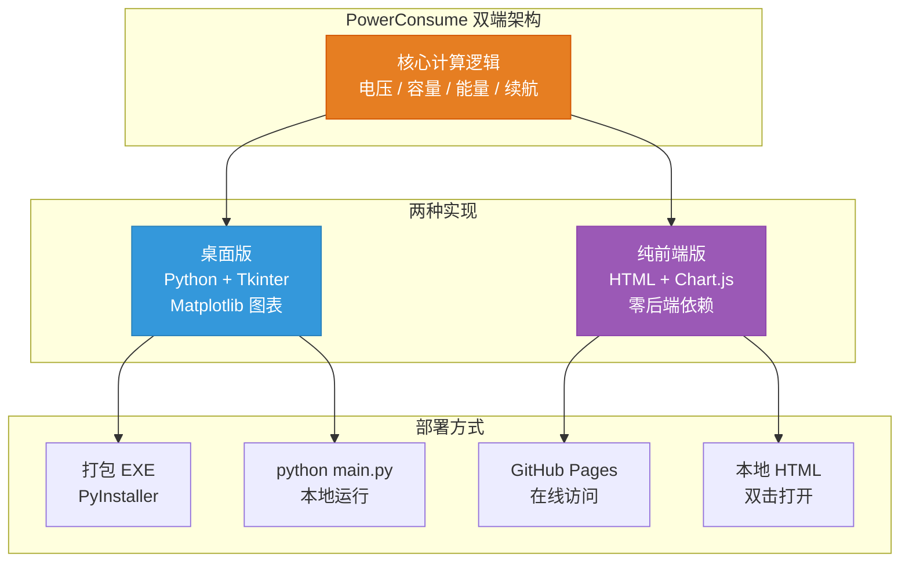
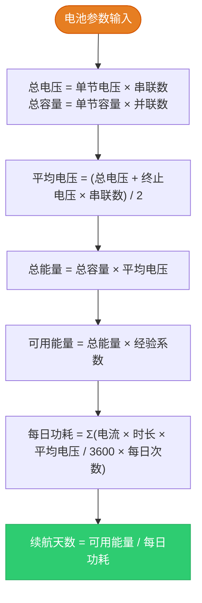
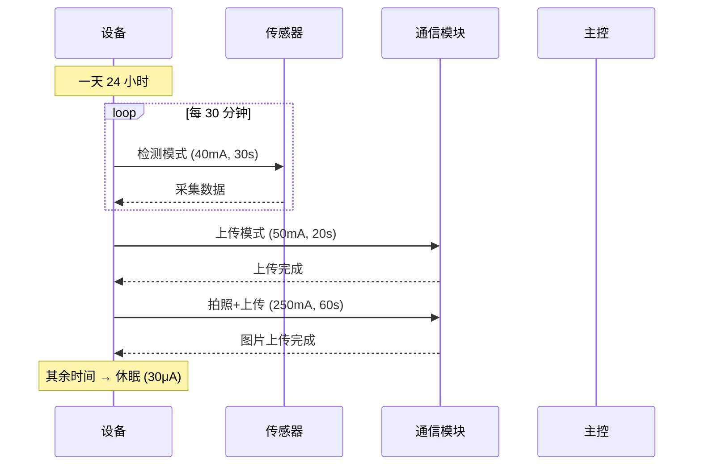
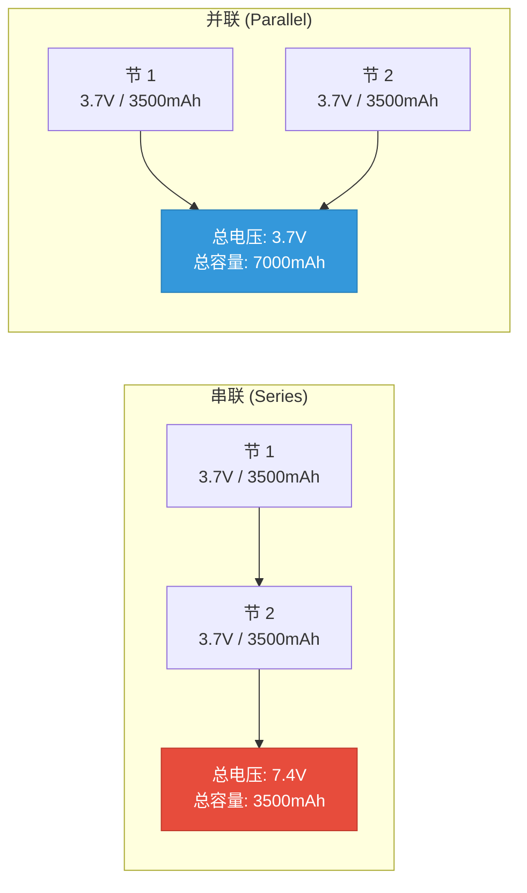
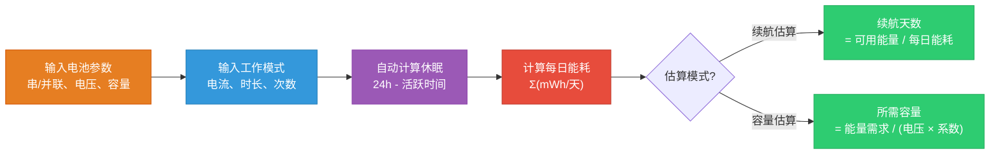

# PowerConsume 功耗计算器：嵌入式设备电池续航的前期估算与选型工具

> 做嵌入式开发、物联网产品的工程师，一定绕不开一个问题：**这颗电池能用多久？** 或者反过来：**要跑 N 天，需要多大的电池？** 手算太麻烦，Excel 容易出错，于是就有了这个工具 —— **PowerConsume 功耗计算器**。
>
> 这是一款**开源免费的电池续航估算工具**，专为硬件设计**前期评估**阶段打造：在还没有 PCB 样品、无法用仪器实测时，基于芯片数据手册的典型电流值，快速估算电池续航的量级，辅助电池选型和功耗预算规划。支持锂电池/锂亚电池/碱性干电池、多种工作模式（检测/上传/休眠）、串并联组合配置，自动推算休眠时长，一键算出续航天数或所需电池容量。提供**桌面版**（Python，可导出 PDF）和**纯前端版**（HTML，双击即用），无需登录即可上手。
>
> **注意**：**计算结果为理论估算值，用于设计前期的量级评估。最终量产产品的续航数据仍需以硬件样品上的实测数据为准。**
>
> 在线体验：[https://stark1898y.github.io/Power-Consumption-Calculator/
> ](https://stark1898y.github.io/Power-Consumption-Calculator/)

---

## 一、为什么需要功耗计算器？

在嵌入式设备、物联网节点、传感器终端等场景中，电池续航是一个核心指标。但实际计算时面临诸多复杂性：

- 设备有**多种工作模式**：检测、上传、拍照、休眠……每种模式的电流和持续时间都不一样
- 电池参数**因类型而异**：锂电池 3.7V、锂亚电池 3.6V、碱性电池 1.5V，放电曲线也不同
- 还要考虑**串并联组合**、**经验系数**（电池实际放电效率通常只有标称的 60%-80%）
- 休眠时间是"剩余时间"，需要从 24 小时中**自动扣除**其他模式的活跃时间

手算这些不仅繁琐，还容易出错。PowerConsume 功耗计算器就是为了解决这些问题而生的。

> **本工具的定位**：设计前期（本工具估算）→ 打样后（仪器实测）→ 量产前（高低温老化实测）。它解决的是「还没有硬件时如何做电池选型和功耗预算」的问题，不替代实测验证。

---

## 二、功能特性一览



---

## 三、两种版本，按需选择

PowerConsume 提供了两种实现版本，覆盖不同的使用场景：

|        版本        |        技术栈        |        文件        |            运行方式            |        适用场景        |
| :----------------: | :------------------: | :-----------------: | :-----------------------------: | :--------------------: |
|  **桌面版**  |   Python + Tkinter   |     `main.py`     | `python main.py` 或 EXE 双击 | 本地离线使用，功能最全 |
| **纯前端版** | HTML + JS + Chart.js | `docs/index.html` | 直接双击打开或部署 GitHub Pages |    零依赖，在线体验    |



### 1. 桌面版（功能最全）

```bash
# 安装依赖
pip install -r requirements.txt

# 运行
python main.py
```

桌面版基于 Tkinter 构建，提供完整的 GUI 界面，支持：

- 双击编辑表格中的数值和单位
- Matplotlib 交互式图表
- 导出 PDF（含中文支持和功耗分布图）
- 保存 / 加载 JSON 配置文件
- 电池老化模型选择
- **卡片式 UI 布局**，蓝紫配色，可滚动窗口
- **底部状态栏**：版本号、版权、GitHub / Gitee 可点击链接


### 2. 纯前端版（推荐在线体验）

直接双击打开 `docs/index.html`，或部署到 GitHub Pages。所有计算逻辑在浏览器端完成，**无需任何后端服务**，零依赖。


---

## 四、核心计算公式

这是整个计算器的数学基础。理解了这些公式，你就理解了工具的全部逻辑。

### 4.1 续航时间计算



用公式表示：

```
总电压 V_total     = V_cell × N_series
总容量 C_total     = C_cell × N_parallel
平均电压 V_avg     = (V_total + V_end × N_series) / 2
总能量 E_total     = C_total × V_avg          (单位: mWh)
可用能量 E_usable  = E_total × K_factor
每日能耗 E_daily   = Σ( I_mode × T_mode × V_avg / 3600 × N_times )
续航天数 D         = E_usable / E_daily
```

### 4.2 所需容量计算（反向计算）

```
所需能量 E_required = E_daily × D_target
所需容量 C_required = E_required / (V_avg × K_factor)
```

### 4.3 关键参数说明

|    参数    | 含义                         |         典型值         |
| :--------: | :--------------------------- | :--------------------: |
|   V_cell   | 单节电池满电电压             | 锂电池 4.2V，锂亚 3.6V |
|   V_end   | 终止电压（电池"没电"的电压） | 锂电池 3.0V，锂亚 3.0V |
|   C_cell   | 单节电池容量 (mAh)           |    18650 约 3500mAh    |
|  N_series  | 串联节数（升压）             |  2 节串联 = 2 倍电压  |
| N_parallel | 并联节数（增容）             |  2 节并联 = 2 倍容量  |
|  K_factor  | 经验系数（放电效率）         | 0.6 ~ 0.8，通常取 0.7 |

**为什么要用平均电压？**

电池从满电到放空，电压是逐渐下降的。用"满电电压"和"终止电压"的平均值来估算能量，比用单一电压值更准确。

**为什么需要经验系数？**

电池标称容量是在理想条件下测得的。实际使用中，大电流放电、温度变化、电池老化等因素都会导致可用容量降低。经验系数 0.7 意味着实际只能用到标称容量的 70%。

---

## 五、工作模式与休眠自动计算

这是 PowerConsume 最实用的功能之一。实际的嵌入式设备不会一直以同一个电流工作，而是有多种模式交替运行：



### 示例场景

|   模式   | 电流 | 电流单位 | 持续时间 | 时长单位 | 每天次数 |
| :-------: | :--: | :------: | :------: | :------: | :------: |
|   检测   |  40  |    mA    |    30    |    s    |    48    |
|   上传   |  50  |    mA    |    20    |    s    |    1    |
| 拍照+上传 | 250 |    mA    |    60    |    s    |    1    |
|   休眠   |  30  |    uA    | 自动计算 |    -    |    1    |

**休眠时长自动计算逻辑：**

```
活跃时间 = (30s × 48) + (20s × 1) + (60s × 1) = 1520s
休眠时间 = 86400s - 1520s = 84880s ≈ 23.58 小时
```

这意味着设备每天有约 23.58 小时处于 30μA 的休眠状态，只有约 25 分钟在"干活"。

---

## 六、串并联配置

电池组的串并联设计直接影响电压和容量：



|   配置   | 电压变化 | 容量变化 | 典型应用                         |
| :-------: | :------: | :------: | :------------------------------- |
| 2 串 1 并 | 2× 电压 | 1× 容量 | 需要高电压的场景（如 7.4V 供电） |
| 1 串 2 并 | 1× 电压 | 2× 容量 | 延长续航，电压不变               |
| 2 串 2 并 | 2× 电压 | 2× 容量 | 同时升压和增容                   |

---

## 七、电池类型预设

PowerConsume 内置了三种常见电池类型的默认参数，选择后自动填充：

|          电池类型          | 满电电压 | 终止电压 | 典型容量 | 默认串并联 |
| :------------------------: | :------: | :------: | :-------: | :--------: |
|      锂电池 (Li-ion)      |   4.2V   |   3.6V   | 3500 mAh |   1串1并   |
| 一次性锂亚电池 (Li-SOCl₂) |   3.6V   |   3.3V   | 19000 mAh |   1串2并   |
|   碱性干电池 (Alkaline)   |   1.5V   |   1.0V   | 2700 mAh |   2串1并   |

**锂亚电池**（ER14505 等）是物联网低功耗设备的首选，容量大、自放电率极低，适合需要数年续航的场景。

**碱性干电池**两节串联是因为单节 1.5V 太低，两节串联得到 3V 供大多数 MCU 使用。

---

## 八、技术实现分析

### 8.1 项目结构

```
power-consumption-calculator/
├── main.py                    # 桌面版主程序 (Python + Tkinter GUI)
├── docs/
│   └── index.html             # 纯前端版 (HTML + Chart.js，零后端依赖)
├── requirements.txt           # Python 依赖（桌面版）
├── PowerConsumeCalculator.spec # PyInstaller 打包配置
├── dist/
│   └── PowerConsumeCalculator.exe  # Windows 可执行文件
├── LICENSE                    # MIT 许可证
└── README.md
```

### 8.2 桌面版核心实现

桌面版使用 `PowerConsumeCalculator` 类封装所有逻辑，关键模块：

**时间单位转换**

```python
def convert_to_seconds(value: float, unit: str) -> float:
    """将任意单位的时间转换为秒"""
    factor = {"ms": 0.001, "min": 60, "h": 3600, "天": 86400}
    return value * factor.get(unit, 1)
```

**能量计算核心**

```python
# 单次循环能量 (mWh)
energy_per_cycle_mwh = (current_ma * seconds * average_voltage) / 3600

# 每日总能耗
daily_energy_mwh = energy_per_cycle_mwh * times_per_day

# 续航天数
days = usable_energy_mwh / daily_total_energy
```

**休眠时长自动更新**

```python
def update_sleep_duration(self):
    """自动计算并更新休眠时间"""
    total_active_time = 0
    for item in self.mode_table.get_children():
        values = self.mode_table.item(item, "values")
        if values[0] == "休眠":
            sleep_item = item
            continue
        seconds = convert_to_seconds(float(values[4]), values[3])
        total_active_time += seconds * int(values[5])

    sleep_duration = max(0, 86400 - total_active_time)  # 24h - 活跃时间
```

**PDF 导出（含中文支持）**

桌面版使用 `fpdf2` 库导出 PDF，自动检测系统中文字体（Windows SimHei / macOS PingFang / Linux WQY Zen Hei），并嵌入 Matplotlib 生成的功耗分布图。

### 8.3 桌面版 UI 设计

桌面版采用**卡片式布局**，参考了网页版的视觉风格：

|        组件        | 设计要素                                                             |
| :----------------: | :------------------------------------------------------------------- |
| **标题横幅** | 蓝紫渐变色 (`#667eea`)，白色标题 + 版本号                          |
| **卡片容器** | 白色背景 + 浅灰边框 + 左侧紫色指示条                                 |
| **操作按钮** | 6 种颜色区分功能（蓝=主操作、绿=保存、橙=导出、红=清空），hover 变暗 |
| **计算按钮** | 大号加粗蓝紫色，视觉焦点                                             |
| **结果区域** | Consolas 等宽字体，左侧紫色指示条，富文本标签（标题/高亮/分隔线）    |
|   **表格**   | 紫色表头、白色背景、选中行高亮                                       |
|  **状态栏**  | 底部灰色条，版本号 + 版权 + GitHub/Gitee 可点击链接                  |
| **滚动支持** | Canvas + Scrollbar，窗口自由缩放时内容自适应宽度                     |

配色方案统一使用 `COLORS` 字典，与网页版保持一致的视觉语言。

### 8.4 纯前端版实现

纯前端版将所有计算逻辑用 JavaScript 重写，图表使用 Chart.js 渲染，**无需任何后端**，单个 HTML 文件即可运行：

```javascript
// 能量计算
function calcDailyEnergy(currentMA, seconds, voltage) {
    return (currentMA * seconds * voltage) / 3600; // mWh
}

// 续航天数
function calcBatteryDays(usableEnergy, dailyEnergy) {
    return usableEnergy / dailyEnergy;
}
```

### 8.5 依赖说明

|    依赖    |   版本   | 用途               |
| :--------: | :-------: | :----------------- |
| matplotlib | ≥ 3.5.0 | 图表绘制（桌面版） |
|   numpy   | ≥ 1.21.0 | 数值计算（桌面版） |
|   fpdf2   | ≥ 2.7.0 | PDF 导出（桌面版） |
|   Pillow   | ≥ 8.0.0 | 图像处理（桌面版） |

---

## 九、实际应用举例

### 例 1：IoT 传感器节点续航估算

**场景**：一个使用 ER14505 锂亚电池（3.6V / 19000mAh）的温湿度传感器，每 30 分钟检测一次（40mA / 30s），每天上传一次数据（50mA / 20s）。

**输入参数：**

- 电池类型：一次性锂亚电池
- 串联：1，并联：2
- 经验系数：0.7

**计算过程：**

```
总电压   = 3.6V × 1 = 3.6V
总容量   = 19000mAh × 2 = 38000mAh
平均电压 = (3.6 + 3.3) / 2 = 3.45V
总能量   = 38000 × 3.45 = 131100 mWh
可用能量 = 131100 × 0.7 = 91770 mWh

检测能耗 = (40mA × 30s × 3.45V / 3600) × 48 = 55.2 mWh/天
上传能耗 = (50mA × 20s × 3.45V / 3600) × 1  = 0.958 mWh/天
休眠能耗 = (0.03mA × 84880s × 3.45V / 3600) × 1 = 2.43 mWh/天
每日总功耗 ≈ 58.59 mWh

续航天数 = 91770 / 58.59 ≈ 1566 天 ≈ 4.29 年
```

**结论：** 两节锂亚电池并联，理论续航约 **1500~1600 天（约 4~4.5 年）**。实际因温度、放电效率等因素，建议按 3~5 年的量级做规划。

### 例 2：反向计算所需电池容量

**场景**：一个设备需要续航 365 天，每日功耗已知为 100mAh 等效，使用 3.7V 锂电池，经验系数 0.7。

```
所需能量 = 100mAh × 3.7V × 365 = 135050 mWh
所需容量 = 135050 / (3.7 × 0.7) ≈ 52115 mAh
```

**结论：** 估算约需 45000~55000mAh 的电池组，可考虑约 13~16 节 3500mAh 18650 电池并联。最终容量还需根据实测功耗修正。

---

## 十、常见问题

### Q1：计算结果和实测差距有多大？

这是最关键的问题。计算结果反映的是「理想情况下的理论上限」。实际产品中，以下因素会导致实测与估算存在差距：

- **芯片实际功耗**通常高于数据手册典型值，数据手册给出的往往是室温下的最小/典型值
- PCB 漏电流、LDO/DC-DC 转换效率损耗一般不会体现在数据手册中
- 温度变化对电池容量的影响显著（低温时容量可能衰减 20%~40%）
- 外围电路的静态功耗难以精确统计（上拉电阻、分压电路、LED 指示等）
- 电池自放电率在高温环境下会明显增加

因此，**计算结果应视为量级估算（如"能用 3~5 年"），而非精确值（如"能用 4.29 年"）**。最终续航数据必须在硬件样品上实际测量验证。本工具的价值在于设计前期帮你快速排除不合理的方案，避免电池选型出现数量级错误。

### Q2：经验系数应该取多少？

经验系数取决于多个因素：

|          场景          |   建议系数   | 说明                 |
| :---------------------: | :----------: | :------------------- |
| 低功耗设备 (< 1mA 平均) |  0.8 ~ 0.9  | 放电电流小，效率高   |
| 中等功耗设备 (1~100mA) |  0.6 ~ 0.7  | 常见 IoT 场景        |
|  高功耗设备 (> 100mA)  |  0.5 ~ 0.6  | 大电流放电效率低     |
|      高温/低温环境      |   再降 0.1   | 温度影响显著         |
|      电池老化严重      | 再降 0.1~0.2 | 循环次数多了容量衰减 |

### Q3：为什么用平均电压而不是额定电压？

电池放电曲线不是平的。以锂电池为例：

```
满电:    4.2V ──┐
                ├── 平均 ≈ 3.6V  ( (4.2+3.0) / 2 )
终止:    3.0V ──┘
```

用平均电压计算能量更接近实际情况。

### Q4：休眠时间自动计算的逻辑是什么？

```
休眠时间 = 86400秒 - Σ(各活跃模式时长 × 每日次数)
```

当所有活跃模式的总时间超过 24 小时时，休眠时间为 0（说明工作模式配置不合理）。

### Q5：串并联对计算有什么影响？

- **串联**：电压叠加，容量不变。影响"总电压"和"平均电压"
- **并联**：容量叠加，电压不变。影响"总容量"

计算时使用的是**总电压**和**总容量**，而不是单节参数。

### Q6：纯前端版和桌面版的计算结果一样吗？

完全一样。两个版本共享相同的计算逻辑，只是 UI 实现不同。桌面版用 Python，前端版用 JavaScript。

---

## 十一、项目配置示例

PowerConsume 支持将当前配置保存为 JSON 文件，方便复用和分享：

```json
{
    "battery_info": {
        "type": "一次性锂亚电池",
        "experience_factor": "0.7",
        "series_count": "1",
        "parallel_count": "2",
        "cell_voltage": "3.6",
        "end_voltage": "3.3",
        "cell_capacity": "19000"
    },
    "calc_mode": "续航时间",
    "input_value": "5000",
    "input_unit": "天",
    "modes": [
        {
            "mode": "检测",
            "current_unit": "mA",
            "current_value": "40",
            "duration_unit": "s",
            "duration_value": "30.0",
            "times_per_day": "48"
        },
        {
            "mode": "上传",
            "current_unit": "mA",
            "current_value": "50",
            "duration_unit": "s",
            "duration_value": "20.0",
            "times_per_day": "1"
        },
        {
            "mode": "休眠",
            "current_unit": "uA",
            "current_value": "30",
            "duration_unit": "s",
            "duration_value": "0",
            "times_per_day": "1"
        }
    ]
}
```

---

## 十二、局限性与改进方向

作为客观的分析，PowerConsume 目前也有一些可以改进的地方：

|    方面    | 现状                         | 可改进方向                                  |
| :--------: | :--------------------------- | :------------------------------------------ |
|  放电曲线  | 使用线性平均电压近似         | 支持自定义放电曲线，积分计算                |
|  温度影响  | 未考虑                       | 加入温度修正系数                            |
|  电池老化  | 有老化模型框架，但未深度集成 | 基于循环次数的容量衰减曲线                  |
| 多化学体系 | 仅 3 种预设                  | 扩展更多电池类型（磷酸铁锂、铅酸等）        |
|  功耗叠加  | 假设模式串行执行             | 支持并行功耗叠加（如 MCU + 传感器同时工作） |
|  电流输入  | 依赖用户输入电流值           | 引入常见芯片数据库，根据选型自动填充典型值  |

---

## 十三、EXE 打包发布

桌面版支持通过 PyInstaller 打包为单文件 EXE，**无需 Python 环境即可运行**：

```bash
# 安装 PyInstaller
pip install pyinstaller

# 打包（使用项目提供的 spec 文件）
pyinstaller PowerConsumeCalculator.spec

# 输出位置
dist/PowerConsumeCalculator.exe
```

打包后的 EXE 包含所有依赖（matplotlib、numpy、fpdf2、tkinter 等），约 40MB，双击即可使用。

> **注意**：打包时需要确保系统已安装所有 `requirements.txt` 中的依赖，否则 EXE 运行时会报 `ModuleNotFoundError`。

---

## 十四、总结



**PowerConsume 功耗计算器** 解决了嵌入式设备电池续航前期评估的核心痛点：

- 多模式、多单位、串并联的复杂场景一键估算
- 休眠时间自动推算，不用手减
- 双端覆盖：桌面版 + 纯前端版，按需选择
- 配置可保存 / 加载，便于团队协作

无论是做产品方案评估、还是写技术文档汇报，它都是一个实用的工具。

> **重要提醒**：本工具提供的是理论估算值，适用于设计前期的电池选型和功耗预算规划。记住这条链路：**设计前期用本工具估算 → 打样后用仪器实测 → 量产前做高低温老化验证**。每一步都不可替代。

---

## 项目地址

> 🔗 **在线体验**：[https://stark1898y.github.io/Power-Consumption-Calculator/](https://stark1898y.github.io/Power-Consumption-Calculator/)

|   平台   |                                                         链接                                                         |   说明   |
| :-------: | :-------------------------------------------------------------------------------------------------------------------: | :------: |
| ⭐ GitHub | [https://github.com/stark1898y/Power-Consumption-Calculator](https://github.com/stark1898y/Power-Consumption-Calculator) |  主仓库  |
| 🚀 Gitee |   [https://gitee.com/stark1898/power-consumption-calculator](https://gitee.com/stark1898/power-consumption-calculator)   | 国内镜像 |

欢迎 **Star** | **Fork** | **Issue**

---

## 参考

- [PowerConsume功耗计算器](https://blog.csdn.net/yufm/article/details/134437810)
